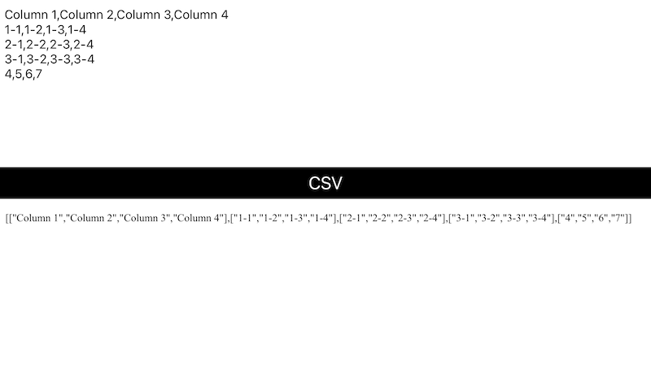

# WWJavaScriptContext+CSV
[](https://developer.apple.com/swift/) [](https://developer.apple.com/swift/)  [](https://developer.apple.com/swift/) [](https://developer.apple.com/swift/)

### [Introduction - 簡介](https://swiftpackageindex.com/William-Weng)
- [Use JavaScript to convert CSV text.](https://github.com/mholt/PapaParse)
- [使用JavaScript做CSV的文字轉換。](https://cdnjs.cloudflare.com/ajax/libs/PapaParse/5.4.1/papaparse.min.js)



### [Installation with Swift Package Manager](https://medium.com/彼得潘的-swift-ios-app-開發問題解答集/使用-spm-安裝第三方套件-xcode-11-新功能-2c4ffcf85b4b)
```js
dependencies: [
    .package(url: "https://github.com/William-Weng/WWJavaScriptContext_CSV.git", .upToNextMajor(from: "1.1.0"))
]
```

### Function - 可用函式
|函式|功能|
|-|-|
|convert(csv:)|轉換CSV => JSValue|

### Example
```swift
import UIKit
import WebKit
import WWJavaScriptContext
import WWJavaScriptContext_CSV

final class ViewController: UIViewController {
    
    @IBOutlet weak var myTextView: UITextView!
    @IBOutlet weak var myWebView: WKWebView!
    
    override func viewDidLoad() {
        super.viewDidLoad()
    }
    
    @IBAction func convertCSV(_ sender: UIButton) {
        
        defer { view.endEditing(true) }
        
        guard let csv = myTextView.text,
              let array = WWJavaScriptContext.CSV.shared.convert(csv: csv)?.toArray(),
              let jsonString = array._jsonString()
        else {
            return
        }
        
        myWebView.loadHTMLString("\(jsonString)", baseURL: nil)
    }
}
```
